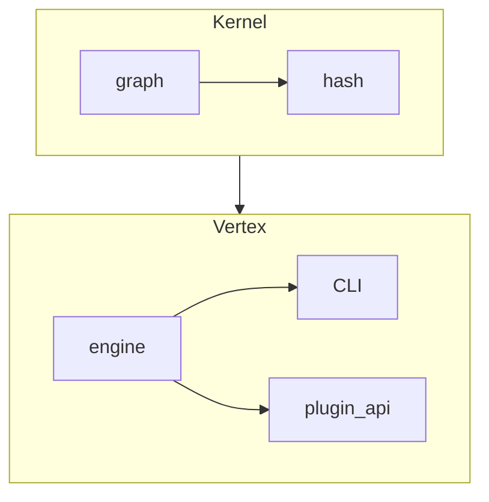

CLEAR_FILE_CONTENT
# Veritas Core 0.9

Immutable kernel + vertex orchestrator powering the Veritas "Operating System for Clarity".

• **Kernel** – pure, side-effect-free graph & hashing logic (`veritas.kernel.*`).  
• **Vertex** – execution engine, plugin interface, Typer-CLI (`veritas.vertex.*`).

```bash
pip install veritas-core

# verify any repo that has logic-graph.yml
veritas check --stats --quiet
```

---
## Quick demo
```bash
veritas point artifact/code/            # analyse artefacts
veritas link  logic-graph.yml           # verify DAG contracts
veritas ask   --stats --pretty          # pretty graph metrics
```

---
## Verification status (auto-generated)
<!-- STATUS-START -->
<!-- STATUS-END -->

> ✱ To render the status table locally run `pip install veritas-markdown` then
> `veritas status`. The core package itself does **not** vend Markdown
> reporter to stay minimal.

---
## Architecture


Formal spec ⇒ `docs/SPEC.md`   •   Glossary ⇒ `docs/BRAND.md`

---
©️ 2024 The Veritas Project – MIT License
