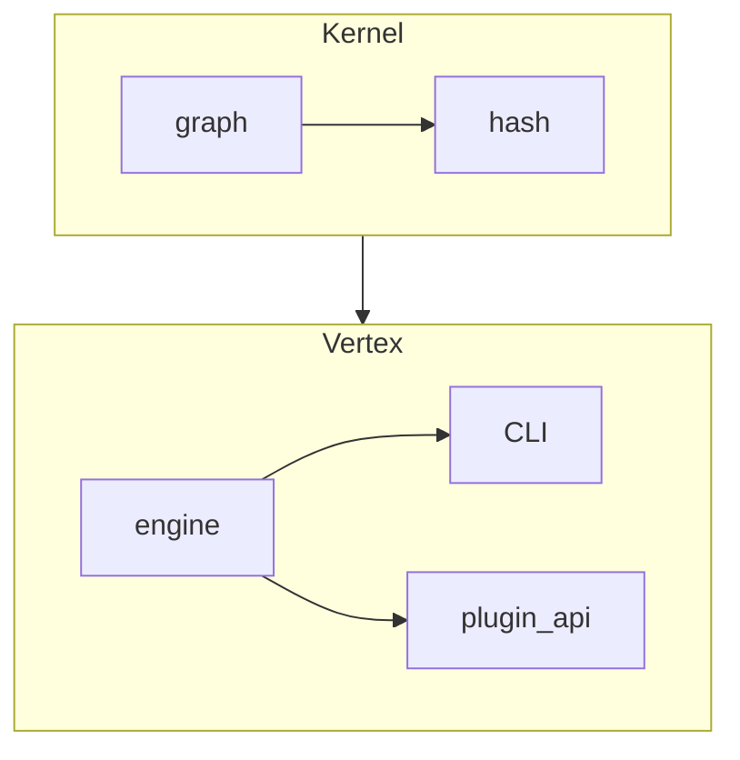

# Veritas Core

Minimal reference implementation of the Veritas contract graph engine.

---
## Install (from source)
```bash
pip install .[cli,stats]
```

---
## Quickstart

```bash
# Verify a repository that contains logic-graph.yml
veritas check --stats --quiet

# Ask the engine for graph metrics
veritas ask --json
```

---
## Architecture (high-level)


---
## MDR: Flow + Dissipation (Core Theory)

Veritas Core implements MDR (Minimal Dissipative Reasoning):
- **Flow** — the flow of obligations through the graph (edges: obligations).
- **Dissipation** — control of trust loss/entropy (cycles, self-checks, radius, entropy).

Each edge is a flow; plugins can implement both flow checks and dissipation control (e.g., `radius_tracker`, `mdr_dissipation`).

**Why MDR?** MDR is the minimal invariant for trust in contract graphs: every obligation (flow) must be checked, and dissipation (cycles, entropy) must be controlled. For the full theory and mathematical background, see [docs/MDR.md](docs/MDR.md).

MDR allows building a knowledge-base on top of the core without modifying it: all extensions are via plugins and the graph.

---
## Dependencies & Extras

- Minimal required dependency: `pyyaml`
- Optional (via extras):
  - `networkx` — for graph analysis and stats (`pip install veritas-core[stats]`)
  - `typer`, `rich` — for CLI (`pip install veritas-core[cli]`)
  - `jinja2` — for templating (`pip install veritas-core[templ]`)
- For tests: `pytest` and the `test` extra

Example:
```bash
pip install veritas-core[cli,stats]
```

---
## Verification status (auto-generated)
<!-- STATUS-START -->
<!-- STATUS-END -->

---
© 2024 The Veritas Project – MIT License

---
## Adding custom plugins

Plugins are regular Python packages that expose one or more classes decorated with `@plugin("name")` (see `veritas.vertex.plugin_api.plugin`).

1. Place your package next to the graph *or* install it via pip.
2. List it in the `plugins:` section of `logic-graph.yml`:
   ```yaml
   plugins:
     - ./my_checks          # local directory, editable import
     - acme-veritas-checks  # already installed from PyPI
   ```
3. Run `veritas check` — the engine will `import my_checks` before discovering plugins; your obligation names become available immediately.

See `docs/COOKBOOK.md` for plugin skeletons and recipes.

---
## Policy: Frozen Core
-
## Async execution (preview)

The core runs checks sequentially by default for maximal determinism. For large graphs with independent edges, a level-by-level concurrent strategy is available. See `docs/ASYNC.md` for details. Final status (trust-stamp) is emitted only after all checks complete; logs are aggregated in a stable order. A production example using Veritas plugins and graph can be seen here: `https://github.com/DanielSwift1992/veritas-black-hole-article`.

- The core (`veritas-core`) is frozen as of version 1.0.0: only bugfixes, no new features.
- All extensions (new checks, integrations, graph types) must be implemented via plugins (see plugin_api, entry-points) and the knowledge-base.
- Any changes to the core require a separate VEP and approval by the steering committee.
- The knowledge-base uses the core as a dependency, without modifying its source code.
