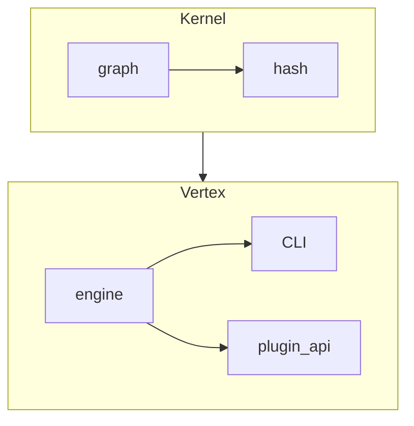

# Veritas Core

Minimal reference implementation of the Veritas contract graph engine.

---
## Install
```bash
pip install veritas-core
```

---
## CLI Overview
```bash
# verify repository that contains logic-graph.yml
veritas check --stats --quiet

# ask engine for graph metrics
veritas ask --json
```

---
## Architecture (high-level)


---
## Verification status (auto-generated)
<!-- STATUS-START -->
<!-- STATUS-END -->

---
© 2024 The Veritas Project – MIT License
