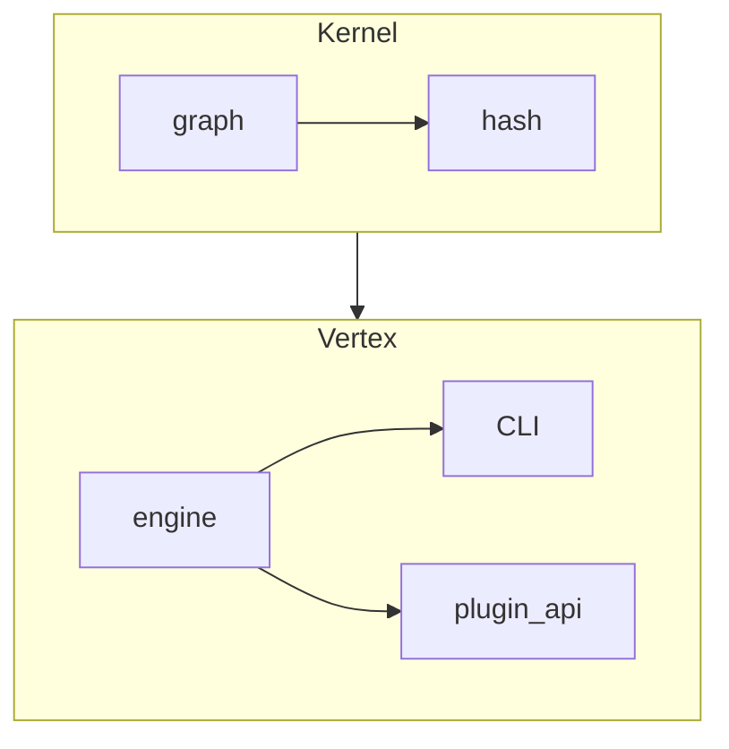

# Veritas Core

Minimal reference implementation of the Veritas contract graph engine.

---
## Install
```bash
pip install veritas-core
```

---
## CLI Overview
```bash
# verify repository that contains logic-graph.yml
veritas check --stats --quiet

# ask engine for graph metrics
veritas ask --json
```

---
## Architecture (high-level)


---
## Verification status (auto-generated)
<!-- STATUS-START -->
<!-- STATUS-END -->

---
© 2024 The Veritas Project – MIT License

## Adding custom plugins
Plugins are regular Python packages that expose one or more classes decorated with `@plugin("name")` (see `veritas.vertex.plugin_api.plugin`).

1. Place your package next to the graph *or* install it via pip.
2. List it in the `plugins:` section of `logic-graph.yml`:
   ```yaml
   plugins:
     - ./my_checks          # local directory, editable import
     - acme-veritas-checks  # already installed from PyPI
   ```
3. Run `veritas check` — the engine will `import my_checks` before discovering plugins; your obligation names become available immediately.

See `docs/COOKBOOK.md` for plugin skeletons and recipes.
