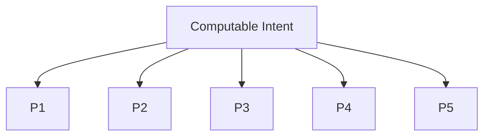

# Veritas Theory – Overview (main.md)

This document is your high-level entry point into the logical foundations and governance of the Veritas Trust-Protocol.

---

## 1  Reading map

| What | Where |
| ---- | ----- |
| Immutable principles (P-0 … P-5) | `PRINCIPLES.md` |
| Legal & mission charter | `CHARTER.md` |
| Contribution workflow & roles | `CONTRIBUTING.md` |
| Community conduct | `CODE_OF_CONDUCT.md` |
| Practical recipes | `../COOKBOOK.md` |
| Broader philosophy & history | `../PHILOSOPHY.md` |

---

## 2  Essence in one paragraph

Veritas treats **logic as a first-class citizen**: every claim about a system must exist as a verifiable contract.  Principle **P-0** (Computable Intent) codifies this axiom; the subsequent five invariants guarantee that such contracts remain ownable, consensual, auditable, reversible and balanced in power.  Together they form a minimal, orthogonal skeleton of trust that can scale from a single repo to an inter-organisation supply chain.

---

## 3  Visual dependency

---

## 4  Human-Focus Ratio (HFR)

A concise, quantitative reason why the framework matters:

$$
\text{HFR} = \frac{I}{I + K + R + D}
$$

LLM assistance and the Veritas engine systematically drive all denominator terms to zero, pushing **HFR → 1**: humans spend their time on *new intent*, not on rote work.

---

*For mathematical proofs and economic analysis see `../whitepaper/WHITEPAPER.pdf` (forthcoming).* 